# Exercícios curso de Engenharia de Dados Semantix 


### Resumo

Este artigo foi inspirado no conteúdo do curso de Engenharia de Dados da [Semantix Academy](<https://academy.semantix.ai/>). 

Objetivo deste documento é um exercício acadêmico para praticar alguns conceitos.


>Este documento foi escrito no Jupiter Notebook com suporte a gravação arquivos Rmd e ao Spark através do PySpark (Python3). As postagens neste canal partiram diretamente do contâiner do docker Spark via linha de comandos.


### Pré-requisitos


Para executar os próximos exemplos, você precisará baixar e instalar alguns "contâniners" docker em sua máquina. Estou estudando a partir de um cluster de Big Data disponibilizado no curso de Engenharia de Dados na Semantix Academy e o meu ambiente é Linux.


* Noções de programação em Python 
* Docker instalado e configurado;
* Cluster de testes instalado;<br>
```$ git clone https://github.com/rodrigo-reboucas/docker-bigdata.git ```
* Noções básicas de HDFS;<br>
[https://github.com/carlosemsantana/docker-namenode-hdfs](<https://github.com/carlosemsantana/docker-namenode-hdfs>)
* Noções básicas do Hive;<br>
[https://github.com/carlosemsantana/docker-hive-server](<https://github.com/carlosemsantana/docker-hive-server>)<br>
* Noções básicas do Spark;<br>
[https://spark.apache.org/](<https://spark.apache.org/>)<br>
[https://academy.semantix.ai/](<https://academy.semantix.ai/>)


### Fonte de dados 


[HISTÓRICO PAINEL COVID - 06/06/2021](<https://mobileapps.saude.gov.br/esus-vepi/files/unAFkcaNDeXajurGB7LChj8SgQYS2ptm/04bd3419b22b9cc5c6efac2c6528100d_HIST_PAINEL_COVIDBR_06jul2021.rar>)


### Exercícios


**1 - Baixar a fonte de dados**

<!-- #region -->
```python 
$ wget -c  https://mobileapps.saude.gov.br/esus-vepi/files/unAFkcaNDeXajurGB7LChj8SgQYS2ptm/04bd3419b22b9cc5c6efac2c6528100d_HIST_PAINEL_COVIDBR_06jul2021.rar
```
<!-- #endregion -->

**1.1 - Enviar os dados para o [hdfs](<https://github.com/carlosemsantana/docker-namenode-hdfs>)**


O HDFS está em execução em um contâiner docker, como baixei os dados na máquina local, uma forma de enviar os dados é copiar os dados da máquina local para o contâiner "namenode" e depois para o hdfs.

<!-- #region -->
```bash
$ docker cp HIST_PAINEL_COVIDBR_06jul2021 namenode:/home
$ docker exec -it namenode bash
$ cd home
$ hdfs dfs -put dados_covid /user/eugenio
$ hdfs dfs -ls /user/eugenio/dados_covid
```
<!-- #endregion -->

**Resultado:**


**2. Otimizar todos os dados do hdfs para uma tabela Hive particionada por
município.**


Crie a tabela **acompanhamento_casos_covid** particionada com a estrutura compatível ao layout dos arquivos da fonte de dados. Lembrando que, a coluna de partição é uma coluna virtual. Ela não faz parte dos dados em si, mas é derivado da partição na qual um determinado conjunto de dados é carregado.
Por padrão, as tabelas são consideradas no formato de entrada de texto e os delimitadores são considerados ^A(ctrl-a). 


Pesquisa exploratória inicial, visão geral dos dados na fonte de dados.

<!-- #region -->
```python
$ hdfs dfs -tail /user/eugenio/dados_covid/HIST_PAINEL_COVIDBR_2020_Parte1_06jul2021.csv
```
<!-- #endregion -->

**Resultado:**


Acesse o contâiner do Hive para criar o banco de dados e a tabela particionada.

<!-- #region -->
```python
$ docker exec -it hive-server bash

$ beeline -u jdbc:hive2://localhost:10000
```
<!-- #endregion -->

**Resultado:**


Crie um banco de dados no Hive.

<!-- #region -->
```python
$ create database Covid19
```
<!-- #endregion -->

**Resultado:**


Crie a tabela particionada, se tiver alguma dúvida com relação aos tipos de dados suportados, consulte as referências: <br>
* [https://cwiki.apache.org/confluence/display/Hive/LanguageManual+Types](<https://cwiki.apache.org/confluence/display/Hive/LanguageManual+Types>) <br>
* [https://spark.apache.org/docs/latest/sql-ref-datatypes.html](<https://spark.apache.org/docs/latest/sql-ref-datatypes.html>)


Para criarmos a estrutura da tabela é precisa conhecer qual é a estrutura dos dados de origem, quais são os atributos da tabela, tipos, volume dos dados, etc... Faremos a consulta diretamente no hdfs.

<!-- #region -->
```python 
$ hdfs dfs -cat /user/eugenio/dados_covid/HIST_PAINEL_COVIDBR_2020_Parte1_06jul2021.csv | head -n 1
```
<!-- #endregion -->
**Resposta:** regiao; estado; municipio; coduf; codmun; codRegiaoSaude; nomeRegiaoSaude; data; semanaEpi; populacaoTCU2019; casosAcumulado; casosNovos; obitosAcumulado; obitosNovos; Recuperadosnovos; emAcompanhamentoNovos; interior/metropolitana


Fonte de dados da Pesquisa da descrição dos campos [https://covid.saude.gov.br/](<https://covid.saude.gov.br/>).


<table>
    <tr>
        <td ><b>CAMPO</b></td>
            <td ><b>TIPO</b></td>
            <td ><b>DESCRIÇÃO</b></td>
    </tr>
    <tr>
        <td>regiao</td>
        <td>StringType</td>
        <td>Região do País. **Atenção**. Existe uma região com nome "Brasil", não encontramos o dicionário de dados com esclarecimento a respeito de que forma os dados aqui estão representados. Verificar</td>
    </tr>
    <tr>
        <td>estado</td>
        <td>StringType</td>
        <td>Sigla do Estado</td>
    </tr>
     <tr>
        <td>municipio</td>
        <td>StringType</td>
        <td>Nome do Município</td>
    </tr>
    <tr>
        <td>coduf</td>
        <td>IntegerType</td>
        <td>Código da Unidade Federativa</td>
    </tr>
    <tr>
        <td>codmun</td>
        <td>IntegerType</td>
        <td>Código do Município</td>
    </tr>
    <tr>
        <td>codRegiaoSaude</td>
        <td>IntegerType</td>
        <td>Código da Região de Saúde</td>
    </tr>
    <tr>
        <td>nomeRegiaoSaude</td>
        <td>IntegerType</td>
        <td>Considera-se Região de Saúde o espaço geográfico contínuo constituído por agrupamento de Municípios limítrofes, delimitado a partir de identidades culturais, econômicas e sociais e de redes de comunicação e infraestrutura de transportes compartilhados, com a finalidade de integrar a organização, o planejamento e a execução de ações e serviços de saúde.</td>
    </tr>
    <tr>
        <td>data</td>
        <td>DateType</td>
        <td>Data da notificação. O processo de atualização dos dados sobre casos e óbitos confirmados por COVID-19 no Brasil é realizado diariamente pelo Ministério da Saúde através das informações oficiais repassadas pelas Secretarias Estaduais de Saúde das 27 Unidades Federativas brasileiras. Os dados fornecidos pelos estados são consolidados e disponibilizados publicamente todos os dias, em torno das 19h.</td>
    </tr>
    <tr>
        <td>semanaEpi</td>
        <td>IntegerType</td>
        <td>período de tempo padrão para agrupar mortes e outros eventos epidemiológicos, conhecido como semana epidemiológica. A divisão dos 365 dias do ano em 52 ou 53 semanas epidemiológicas constitui o chamado calendário epidemiológico.</td>
    </tr>
    <tr>
        <td>populacaoTCU2019</td>
        <td>IntegerType</td>
        <td>População Residente - Estimativas para o TCU - DATASUS</td>
    </tr>
    <tr>
        <td>casosAcumulado</td>
        <td>IntegerType</td>
        <td>Número total de casos confirmados por COVID-19 que foram registrados pelas Secretarias Municipais e Estaduais de Saúde no período considerado.</td>
    </tr>
    <tr>
        <td>casosNovos</td>
        <td>IntegerType</td>
        <td>Número de casos novos confirmados por COVID-19 que foram registrados pelas Secretarias Municipais e Estaduais de Saúde em relação ao dia anterior.
Reflete o número de casos diagnosticados e registrados pelas secretarias de saúde, não significando a data de início dos sintomas. Para análise dos casos por data de início dos sintomas, deve-se utilizar os dados do sistema e-SUS VE e do Sistema de Vigilância Epidemiológica da Gripe (SIVEP-Gripe), para os casos de Síndrome Respiratória Aguda Grave (SRAG) Hospitalizados, além dos dados provenientes dos sistemas de informação de Síndrome Gripal implantados em alguns estados.</td>
    </tr>
     <tr>
        <td>obitosAcumulado</td>
        <td>IntegerType</td>
        <td>Número total de óbitos confirmados por COVID-19 que foram registrados pelas Secretarias Municipais e Estaduais de Saúde no período considerado.</td>
    </tr>
     <tr>
        <td>obitosNovos</td>
        <td>IntegerType</td>
        <td>Número de óbitos novos confirmados por COVID-19 que foram registrados pelas Secretarias Municipais e Estaduais de Saúde em relação ao dia anterior.
Reflete o número de óbitos reportados pelas secretarias de saúde na data em que tiveram a confirmação laboratorial ou clínico epidemiológica. Não reflete a data de ocorrência do óbito. Para análise de óbitos por data de ocorrência, deve-se utilizar os dados registrados no Sistema de Vigilância Epidemiológica da Gripe (SIVEP-Gripe), onde devem ser notificados todos os casos de Síndrome Respiratória Aguda Grave (SRAG) Hospitalizados ou óbitos por SRAG, independente de hospitalização. Também devem ser observados os registros de óbitos no Sistema de Informação sobre Mortalidade (SIM).</td>
    </tr>
     <tr>
        <td>Recuperadosnovos</td>
        <td>IntegerType</td>
        <td>Segundo a Organização Mundial da Saúde, para os casos de COVID-19 confirmados por critério laboratorial, considera-se como recuperados aqueles que tiveram dois resultados negativos para SARS-CoV-2 com pelo menos 1 dia de intervalo. Para os casos leves, a OMS estima que tempo entre o início da infecção e a recuperação dure até 14 dias.</td>
    </tr>
     <tr>
        <td>emAcompanhamentoNovos</td>
        <td>IntegerType</td>
        <td>São considerados como “em acompanhamento” todos os casos notificados nos últimos 14 dias pelas Secretarias Estaduais de Saúde e que não evoluíram para óbito. Além disso, dentre os casos que apresentaram SRAG e foram hospitalizados, considera-se “em acompanhamento” todos aqueles que foram internados nos últimos 14 dias e que não apresentam registro de alta ou óbito no SIVEP Gripe.</td>
    </tr>
     <tr>
        <td>interior/metropolitana</td>
        <td>IntegerType</td>
        <td>Interior ou Metropolitana?. **Atenção**. não encontramos o dicionário de dados com esclarecimento a respeito de que forma os dados aqui estão representados. Verificar.</td>
    </tr>
</table>


As **tabelas Particionadas** no Apache Hive permitem otimizar o desempenho durante as pesquisas.


**Atenção:** Verifique se o cluster de desenvolvimento, o qual está estudando, está com o particionamento dinâmico está ativado, caso não esteja, ative-o com as seguintes instruções:
* o SET hive.exec.dynamic.partition = true;
* o SET hive.exec.dynamic.partition.mode = nonstrict ; 


**Criar as tabelas no Hive**

<!-- #region -->
```python
# Criar uma partição sem partição para carga incial dos dados. (poderia ser tabela temporária)
$ create table casos_covid (
                regiao STRING,
                estado STRING, 
                municipio STRING, 
                coduf INT, 
                codmun INT,
                codRegiaoSaude INT,
                nomeRegiaoSaude STRING,
                data DATE,
                semanaEpi INT,
                populacaoTCU2019 INT,
                casosAcumulado INT,
                casosNovos INT,
                obitosAcumulado INT,
                obitosNovos INT,
                Recuperadosnovos INT,
                emAcompanhamentoNovos INT,
                interior_metropolitana INT
                )
  ROW FORMAT DELIMITED
  FIELDS TERMINATED BY ';'
  STORED AS TEXTFILE
  LOCATION '/user/eugenio/dados_covid';
  
# Tabela particionada
$ create table casos_covid_municipio(
                regiao STRING,
                estado STRING, 
                coduf INT, 
                codmun INT,
                codRegiaoSaude INT,
                nomeRegiaoSaude STRING,
                data DATE,
                semanaEpi INT,
                populacaoTCU2019 INT,
                casosAcumulado INT,
                casosNovos INT,
                obitosAcumulado INT,
                obitosNovos INT,
                Recuperadosnovos INT,
                emAcompanhamentoNovos INT,
                interior_metropolitana INT
  )
  PARTITIONED BY (municipio String)
  ROW FORMAT DELIMITED
  STORED AS TEXTFILE;
```
<!-- #endregion -->

**Resultado:**


Tabela sem partição


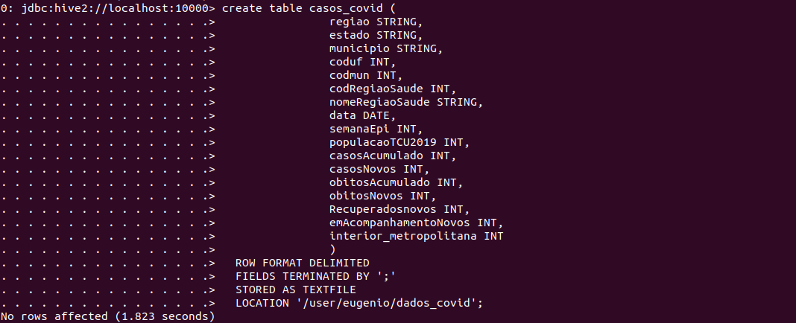


Tabela particionada


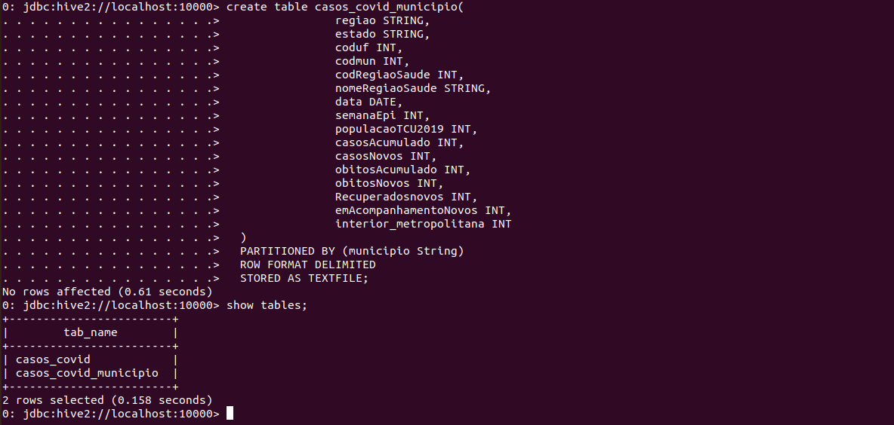


Visualizar a descrição da tabela particionada **casos_covid_municipio**

<!-- #region -->
```python
hive> desc formatted casos_covid_municipio;
```
<!-- #endregion -->

**Resultado:**


**Explorando os dados carregados no Hive**


**Criar as partições automaticamente em tempo de carregamento**

<!-- #region -->
```python
$ hive> insert overwrite table casos_covid_municipio partition (municipio) select * from casos_covid;
```
<!-- #endregion -->

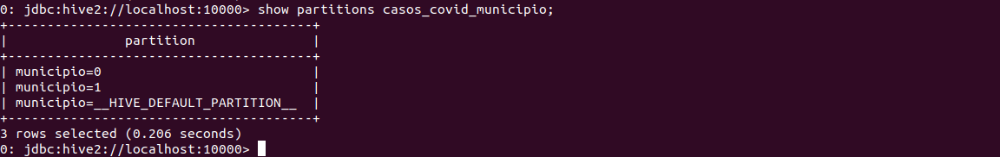


**Consulta as partições criadas no hdfs**


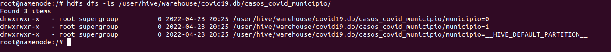


**3. Criar as 3 vizualizações pelo Spark com os dados enviados para o HDFS**

<!-- #region -->
**Visão 1**

Estimativa de casos recuperados e em acompanhamento.

Os registros foram gravados na tabela com valor acumulado, a região = "Brasil" é o total acumulado.

**Casos recuperados**

**Casos em acompanhamento**


**Visão 2**

Casos confirmados
- Acumulado
- Casos novos

**Visão 3**

Óbitos confirmados
- Óbitos acumulados
- Casos novos
<!-- #endregion -->

```python
# Jupyter Notebook com suporte ao PySpark.
```

```python
# imports
from pyspark.sql.functions import *
from pyspark.sql.types import *

# Ler fonte de dados no hdfs
dados = spark.read.csv("/user/eugenio/dados_covid/", sep=";", header="true")

# O layout do dataframe é o seguinte:
# dados.printSchema()
```

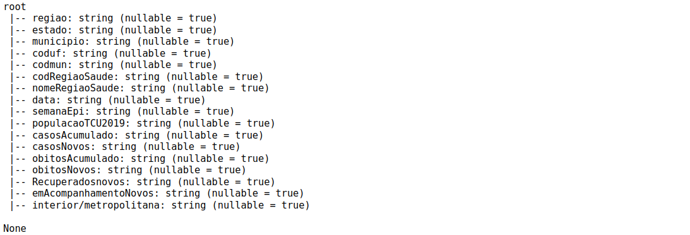

```python
# Pensando em Performance a data poderia ser dinâmica, ao invés de varrer o banco.
# alterar dinâmicamente somente a data no filtro e recupera os dados consolidados 
# por dia.

diaHoje = "2021-07-06" # Entrada de dados dinâmica

df = dados.select(dados.casosAcumulado.alias("Acumulado").cast("int"),
                  dados.casosNovos.alias("CasosNovosConfirmados").cast("int"),
                  dados.obitosAcumulado.alias("ObitosConfirmados").cast("int"),
                  dados.obitosNovos.alias("NovosObitosConfirmados").cast("int"),
                  dados.Recuperadosnovos.alias("CasosRecuperados").cast("int"),
                  dados.emAcompanhamentoNovos.alias("EmAcompanhamento").cast("int"))\
            .filter(col("data")==diaHoje)\
            .filter(col("regiao")=="Brasil")

```

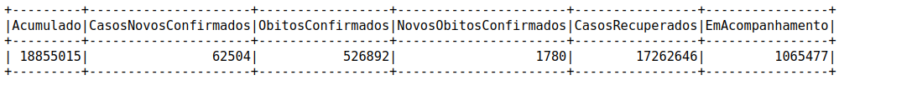

```python
# Cria uma lista para gravarmos a visão 1 como tabela Hive
visao1 = [('CasosRecuperados', df.collect()[0][4]), ("EmAcompanhamento",df.collect()[0][5])]
```


```python
# Cria uma lista para gravarmos a visão 2 como tabela hdf
visao2 = [('Acumulado', df.collect()[0][0]), ("CasosNovosConfirmados",df.collect()[0][1])]
```


```python
# Cria uma lista para gravarmos a visão 2 como tabela Kafka
visao3 = [('ObitosConfirmados', df.collect()[0][2]), ("NovosObitosConfirmados",df.collect()[0][3])]
```


**3.1 Salvar a primeira visualização como tabela Hive**

```python
# Transforma a "visao1" em um DataFrame para gravarmos no Hive
DF = spark.createDataFrame(visao1, ['CasosRecuperados','EmAcompanhamento'])

# Gravar a Visão 1 em uma tabela no banco de dados Hive
DF.write.mode("overwrite").saveAsTable("covid19.Visao1")

```

```python
# Lista os bancos de dados 
# spark.catalog.listDatabases()
```

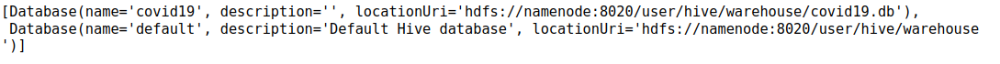

```python
# Lista as tabelas Hive
# spark.catalog.listTables(dbName="covid19")
```

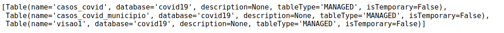


**3.2 Salvar a segunda visualização com formato parquet e compressão snappy**

```python
# Grava Visão 2 no hdfs
# Transforma a "visao2" em um DataFrame para gravarmos no hdfs
DF_2 = spark.createDataFrame(visao2, ['CasosRecuperados','EmAcompanhamento'])
DF_2.write.parquet("/user/eugenio/covid19/Visao2_parquet", mode="overwrite", compression="snappy")
```

```python
# Confirmando se o arquivo foi gravado
```

```python
# !hdfs dfs -ls /user/eugenio/covid19/Visao2_parquet
```


**3.3 Salvar a terceira visualização em um tópico no Kafka**


Para salvar a terceira visualização em um tópico do Kafka, precisamos criar o tópico, segue abaixo exemplo como acessar o contâiner do Kafka, criar o tópico e verificar se foi criado.

<!-- #region -->
```python

$ docker exec -it kafka bash

$ bash-4.4> kafka-topics.sh --bootstrap-server localhost:9092 --topic painel-covid19 --describe

```
<!-- #endregion -->

**Resultado:**


```python
# Inscrição no tópico que foi criado
```

```python
# Ler todas as mensagens postadas no tópico criado.
topic_read = spark.read\
    .format("kafka")\
    .option("kafka.bootstrap.servers", "kafka:9092")\
    .option("subscribe", "painel-covid19")\
    .option("startingOffsets","earliest")\
    .load()
```

```python
# Estrutura criada
# topic_read_stream.printSchema()
```

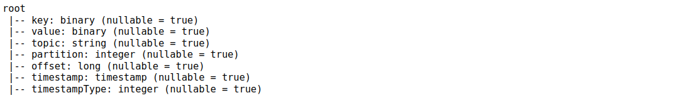


Teste o tópico, criando um produtor e enviando mensagens para verificar se está funcionando.

<!-- #region -->
```python

$ kafka-console-producer.sh --broker-list localhost:9092 --topic painel-covid19

```
<!-- #endregion -->

**Envio de mensagens via console Kafka**


**Ler o tópico**

```python
topic_string = topic_read.select(col("key").cast("string"), col("value").cast("string"))
#topic_string.show()
```


** Gravar mensagens no tópico**

```python
# Busca os dados no formato binário para envio para kafka.
diaHoje = "2021-07-06" # Entrada de dados dinâmica
df_bin = dados.select(dados.obitosAcumulado.alias("ObitosConfirmados"),
                  dados.obitosNovos.alias("NovosObitosConfirmados"))\
            .filter(col("data")==diaHoje)\
            .filter(col("regiao")=="Brasil")
```

```python
# Import necessário para envio de dados para Kafka, existem várias formas de envio.
# Teste de envio
# Existe uma condição, os dados deverão estar no formato binário
from kafka import KafkaProducer
producer = KafkaProducer(bootstrap_servers='kafka:9092')
producer.send('painel-covid19', key=b'101', value=b"Novo Teste")
```

```python
topic_string = topic_read.select(col("key").cast("string"), col("value").cast("string"))
#topic_string.show()
```


**Envio dados para Kafka**

```python
# Conversão dos tipos de dados 
# Cria uma lista para gravarmos a visão 2 como tabela Kafka
visao3 = [('ObitosConfirmados', df_bin.collect()[0][0]), ("NovosObitosConfirmados",df_bin.collect()[0][1])]
```

```python
# Envia os dados para o tópico
# Lembrando que os dados da Visão serão enviados no formato par e valor
# porém, fatiados, Chave + Valor para o valor do campo e assim
# respectivamente até o fim da mensagem.
# 
producer.send('painel-covid19', key=b'200', value= visao3[0][0].encode())
producer.send('painel-covid19', key=b'201', value= visao3[0][1].encode())
producer.send('painel-covid19', key=b'202', value= visao3[1][0].encode())
producer.send('painel-covid19', key=b'203', value= visao3[1][1].encode())
```


```python
# Consulta dos dados enviados, lembrado virão todos os testes.
# Perceba que na chaves código 200 a 203 está a mensagem que foi
# transmitida, o cliente precisará agrupar os dados para ler a
# mensagem completa. Alternativamente, poderíamos criar um protocolo
# e transmitir a mensagem em única chave. (Facilitaria a programação)
topic_string = topic_read.select(col("key").cast("string"), col("value").cast("string"))
#topic_string.show()
```

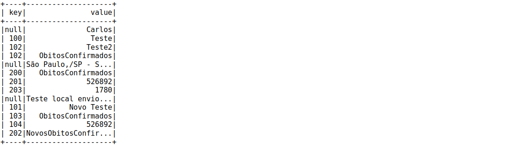


**3.4 Criar a visualização pelo Spark com os dados enviados para o HDFS **


```python
# Criar SQL Database usando as definições padrões do ambiente.
spark.sql("CREATE DATABASE dados_covid_spark")
spark.sql("USE dados_covid_spark")
```

```python
# Criar a tabela
spark.sql("CREATE TABLE dados_covid_spark (regiao STRING, estado STRING, municipio STRING, coduf INT, codmun INT,codRegiaoSaude INT, nomeRegiaoSaude STRING, data DATE, semanaEpi STRING,populacaoTCU2019 INT, casoAcumulado INT, casosNovos INT, obitosAcumulado INT, obitosNovos INT, Recuperadosnovos INT,emAcompanhamentoNovos INT, interior_metropolitana STRING)")
```

```python
#spark.catalog.listDatabases()
```

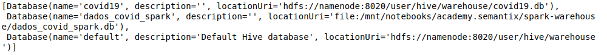

```python
#spark.catalog.listTables()
```


```python
# Estrutura da tabela criada. "Shemma"
#spark.catalog.listColumns("dados_covid_spark")
```

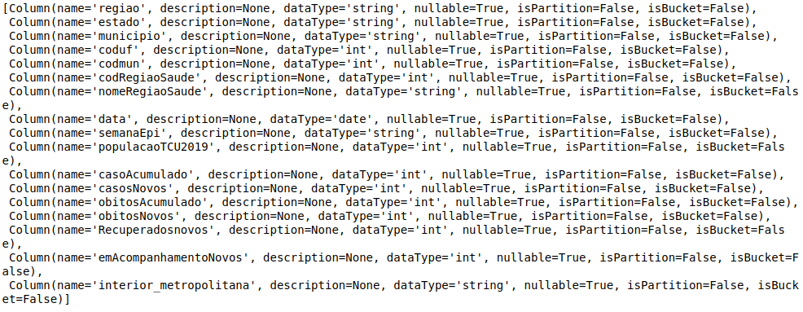


**Carga de dados e manipulação. Podemos usar SQL query ou DataFrame API**

```python
# Estrutura dos dados (Schema) esquema
esquema = "regiao STRING, estado STRING, municipio STRING, coduf INT, codmun INT,codRegiaoSaude INT, nomeRegiaoSaude STRING, data DATE, semanaEpi STRING,populacaoTCU2019 INT, casoAcumulado INT, casosNovos INT, obitosAcumulado INT, obitosNovos INT, Recuperadosnovos INT,emAcompanhamentoNovos INT, interior_metropolitana STRING"
```

```python
# Carregar os dados com os dados que foram enviados no hdfs na tabela criada no Spark.
dados = spark.read.csv("/user/eugenio/dados_covid/", sep=";", schema=esquema, header="false")
```

```python
#dados.show(10)
```

```python
# Efetivar a carga no SQL Banco de Dados Spark, usando a tabela criada anteriormente. (dados_covid_spark)
dados.write.saveAsTable("dados_covid_spark_tb", mode="overwrite")
```

```python
# Crie as "Queries" a partir da origem dos dados arquivos no hdfs (CSV) com SQL ou DataFrame API.
dados_spark = spark.sql("SELECT regiao,casoAcumulado, obitosAcumulado, data FROM dados_covid_spark_tb WHERE data ='2021-07-06' ORDER BY casoAcumulado ASC")
```

```python
# Agrupando os dados
dados_spark.groupBy('regiao').max()
```

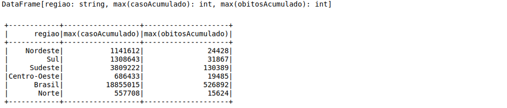

<!-- #region -->
Feito!


Espero ter contribuido com o seu desenvolvimento de alguma forma com a pratica destes exercícios.

<!-- #endregion -->

[Carlos Eugênio Moreira de Santana](<https://github.com/carlosemsantana>)


###  Referências


[ 1 ] [https://covid.saude.gov.br](<Site: https://covid.saude.gov.br/>)<br>
[ 2 ] [https://github.com/carlosemsantana/docker-namenode-hdfs](<https://github.com/carlosemsantana/docker-namenode-hdfs>)<br>
[ 3 ] [https://github.com/carlosemsantana/docker-hive-server](<https://github.com/carlosemsantana/docker-hive-server>)<br>
[ 4 ] [https://hive.apache.org](<https://hive.apache.org>)<br>
[ 5 ] [https://cwiki.apache.org/confluence/display/Hive/LanguageManual+Types](<https://cwiki.apache.org/confluence/display/Hive/LanguageManual+Types>)<br>
[ 6 ] [https://spark.apache.org](<https://spark.apache.org/>)<br>
[ 7 ] [https://spark.apache.org/docs/latest/api/python/reference/api/pyspark.sql.types.StructType.html](<https://spark.apache.org/docs/latest/api/python/reference/api/pyspark.sql.types.StructType.html>)<br>
[ 8 ] [https://academy.semantix.ai/](<https://academy.semantix.ai/>)<br>
[ 9 ] [https://bvsms.saude.gov.br/bvs/saudelegis/cit/2011/res0001_29_09_2011.html](<https://bvsms.saude.gov.br/bvs/saudelegis/cit/2011/res0001_29_09_2011.html>)


