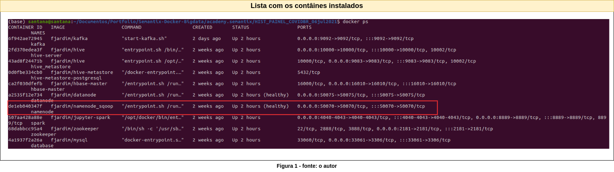
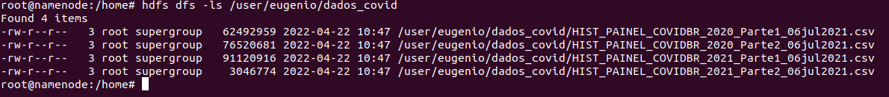
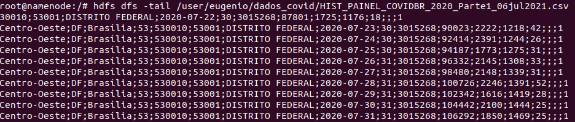
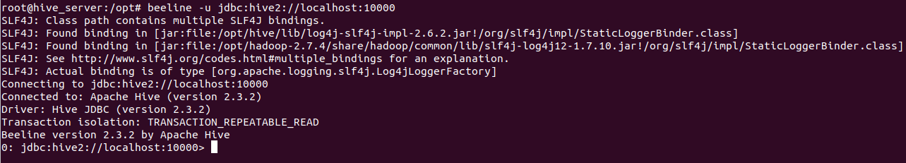
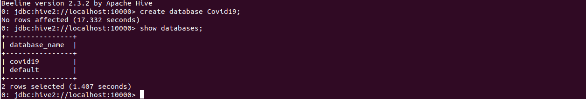
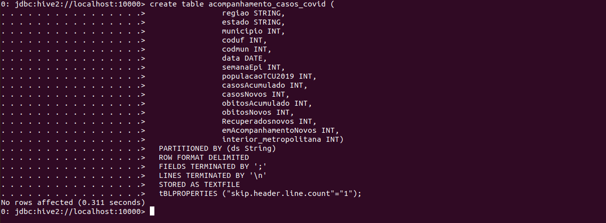
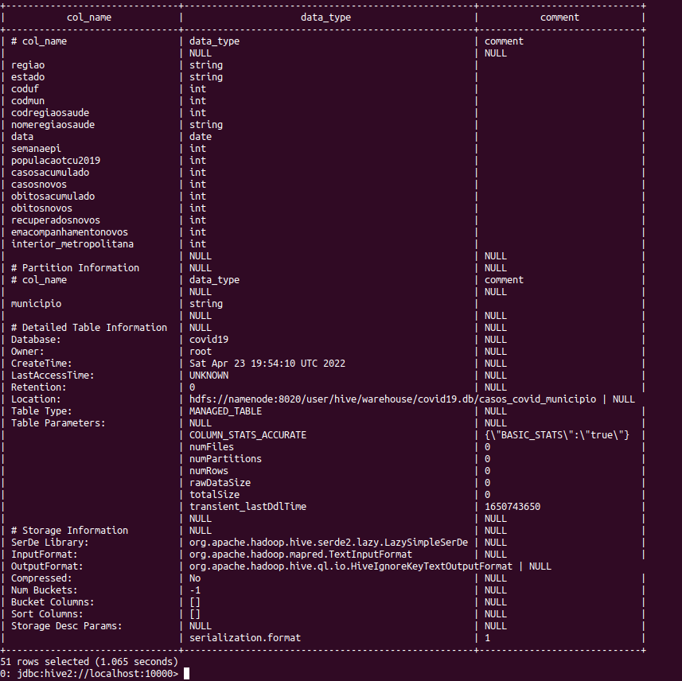
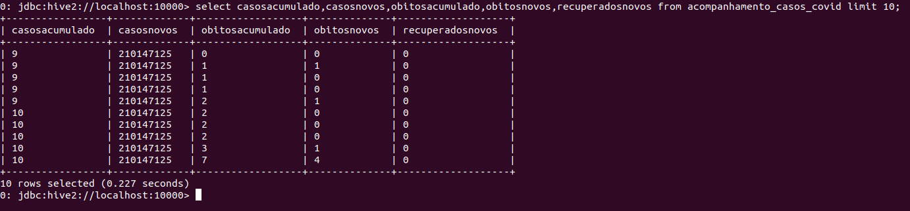

# Campanha Nacional de Vacinação contra Covid-19


### Resumo

Este artigo foi inspirado no conteúdo do curso de Engenharia de Dados da [Semantix Academy](<https://academy.semantix.ai/>). 

Objetivo deste documento é um treinamento acadêmico; desenvolver alguns exercícios na prática, utilizando dados públicos disponíveis no site [https://covid.saude.gov.br/](<https://covid.saude.gov.br/>).


### Pré-requisitos


Para executar os próximos exemplos, você precisará baixar e instalar alguns "contâniners" docker em sua máquina. Estou estudando a partir de um cluster de Big Data disponibilizado no curso de Engenharia de Dados na Semantix Academy e o meu ambiente é Linux.


* Docker instalado e configurado;
* Cluster de testes instalado;<br>
```$ git clone https://github.com/rodrigo-reboucas/docker-bigdata.git ```
* Noções básicas de HDFS;<br>
[https://github.com/carlosemsantana/docker-namenode-hdfs](<https://github.com/carlosemsantana/docker-namenode-hdfs>)
* Noções básicas do Hive;<br>
[https://github.com/carlosemsantana/docker-hive-server](<https://github.com/carlosemsantana/docker-hive-server>)


### Fonte de dados 


[HISTÓRICO PAINEL COVID - 06/06/2021](<https://mobileapps.saude.gov.br/esus-vepi/files/unAFkcaNDeXajurGB7LChj8SgQYS2ptm/04bd3419b22b9cc5c6efac2c6528100d_HIST_PAINEL_COVIDBR_06jul2021.rar>)


### Exercícios


**1 - Baixar a fonte de dados**

<!-- #region -->
```python 
$ wget -c  https://mobileapps.saude.gov.br/esus-vepi/files/unAFkcaNDeXajurGB7LChj8SgQYS2ptm/04bd3419b22b9cc5c6efac2c6528100d_HIST_PAINEL_COVIDBR_06jul2021.rar
```
<!-- #endregion -->

**1.1 - Enviar os dados para o [hdfs](<https://github.com/carlosemsantana/docker-namenode-hdfs>)**


O HDFS está em execução em um contâiner docker, como baixei os dados na máquina local, uma forma de enviar os dados é copiar os dados da máquina local para o contâiner "namenode" e depois para o hdfs.




<!-- #region -->
```bash
$ docker cp HIST_PAINEL_COVIDBR_06jul2021 namenode:/home
$ docker exec -it namenode bash
$ cd home
$ hdfs dfs -put dados_covid /user/eugenio
$ hdfs dfs -ls /user/eugenio/dados_covid
```
<!-- #endregion -->

**Resultado:**





**2. Otimizar todos os dados do hdfs para uma tabela Hive particionada por
município.**


Crie a tabela **acompanhamento_casos_covid** particionada com a estrutura compatível ao layout dos arquivos da fonte de dados. Lembrando que, a coluna de partição é uma coluna virtual. Ela não faz parte dos dados em si, mas é derivado da partição na qual um determinado conjunto de dados é carregado.
Por padrão, as tabelas são consideradas no formato de entrada de texto e os delimitadores são considerados ^A(ctrl-a). 


Pesquisa exploratória para determinar estrutura e tipo de dados.

<!-- #region -->
```python
$ hdfs dfs -tail /user/eugenio/dados_covid/HIST_PAINEL_COVIDBR_2020_Parte1_06jul2021.csv
```
<!-- #endregion -->

**Resultado:**





Acesse o contâiner do Hive para criar a tabela particionada.

<!-- #region -->
```python
$ docker exec -it hive-server bash

$ beeline -u jdbc:hive2://localhost:10000
```
<!-- #endregion -->

**Resultado:**





Crie um banco de dados no Hive.

<!-- #region -->
```python
$ create database Covid19
```
<!-- #endregion -->

**Resultado:**





Crie a tabela particionada, se tiver alguma dúvida com relação aos tipos de dados suportados, consulte a documentação do Hive em: [https://cwiki.apache.org/confluence/display/Hive/LanguageManual+Types](<https://cwiki.apache.org/confluence/display/Hive/LanguageManual+Types>)


**Estrutura do arquivo**

<!-- #region -->
```python
$ create table acompanhamento_casos_covid (
                regiao STRING,
                estado STRING, 
                municipio INT, 
                coduf INT, 
                codmun INT,   
                data DATE,
                semanaEpi INT,
                populacaoTCU2019 INT,
                casosAcumulado INT,
                casosNovos INT,
                obitosAcumulado INT,
                obitosNovos INT,
                Recuperadosnovos INT,
                emAcompanhamentoNovos INT,
                interior_metropolitana INT)
  PARTITIONED BY (ds String)
  ROW FORMAT DELIMITED
  FIELDS TERMINATED BY ';'
  LINES TERMINATED BY '\n'
  STORED AS TEXTFILE
  tBLPROPERTIES ("skip.header.line.count"="1");
```
<!-- #endregion -->

**Resultado:**





Visualizar a descrição da tabela **acompanhamento_casos_covid**

<!-- #region -->
```python
hive> desc formatted acompanhamento_casos_covid;
```
<!-- #endregion -->

**Resultado:**





Carregar os arquivo do HDFS `/user/eugenio/dados_covid/*.*` para a tabela Hive **acompanhamento_casos_covid**

```python
!hdfs dfs -ls /user/eugenio/dados_covid
```

<!-- #region -->
```python
$ LOAD DATA INPATH '/user/eugenio/dados_covid/HIST_PAINEL_COVIDBR_2020_Parte1_06jul2021.csv' OVERWRITE INTO TABLE acompanhamento_casos_covid PARTITION (ds='2020-1');

$ LOAD DATA INPATH '/user/eugenio/dados_covid/HIST_PAINEL_COVIDBR_2020_Parte2_06jul2021.csv' OVERWRITE INTO TABLE acompanhamento_casos_covid PARTITION (ds='2020-2');

LOAD DATA INPATH '/user/eugenio/dados_covid/HIST_PAINEL_COVIDBR_2021_Parte1_06jul2021.csv' OVERWRITE INTO TABLE acompanhamento_casos_covid PARTITION (ds='2021-1');

LOAD DATA INPATH '/user/eugenio/dados_covid/HIST_PAINEL_COVIDBR_2021_Parte2_06jul2021.csv' OVERWRITE INTO TABLE acompanhamento_casos_covid PARTITION (ds='2021-2');

```
<!-- #endregion -->

**Observação:** Caso na carga dos dados ocorra algum erro, a fonte de dados deverá ser enviada novamente para o HDFS, porque no processo de carga os arquivos são movidos fisicamente do hdfs.


### Explorando os dados carregados no Hive




```python

```

```python

```

Pronto!

Chegou o final da jornada, para a instalação e configuração do Apache Hadoop em um container Docker.

Espero ter contribuido com o seu desenvolvimento de alguma forma.

```python

```

[Carlos Eugênio Moreira de Santana](<https://github.com/carlosemsantana>)


###  Referências


[ 1 ] [https://covid.saude.gov.br](<Site: https://covid.saude.gov.br/>)<br>
[ 2 ] [https://github.com/carlosemsantana/docker-namenode-hdfs](<https://github.com/carlosemsantana/docker-namenode-hdfs>)<br>
[ 3 ] [https://github.com/carlosemsantana/docker-hive-server](<https://github.com/carlosemsantana/docker-hive-server>)<br>
[ 4 ] [https://hive.apache.org](<https://hive.apache.org>)<br>
[ 5 ] [https://cwiki.apache.org/confluence/display/Hive/LanguageManual+Types](<https://cwiki.apache.org/confluence/display/Hive/LanguageManual+Types>)


```python

```
