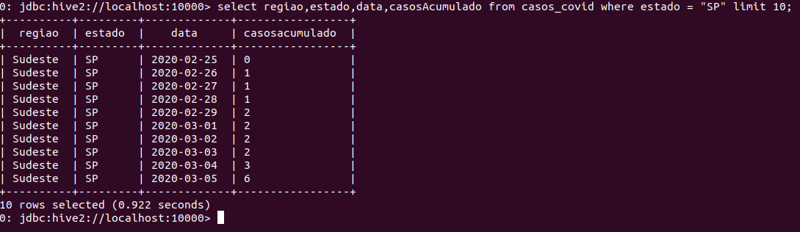

# Campanha Nacional de Vacinação contra Covid-19


### Resumo

Este artigo foi inspirado no conteúdo do curso de Engenharia de Dados da [Semantix Academy](<https://academy.semantix.ai/>). 

Objetivo deste documento é um treinamento acadêmico; desenvolver alguns exercícios na prática, utilizando dados públicos disponíveis no site [https://covid.saude.gov.br/](<https://covid.saude.gov.br/>).


### Pré-requisitos


Para executar os próximos exemplos, você precisará baixar e instalar alguns "contâniners" docker em sua máquina. Estou estudando a partir de um cluster de Big Data disponibilizado no curso de Engenharia de Dados na Semantix Academy e o meu ambiente é Linux.


* Noções de programação em Python 
* Docker instalado e configurado;
* Cluster de testes instalado;<br>
```$ git clone https://github.com/rodrigo-reboucas/docker-bigdata.git ```
* Noções básicas de HDFS;<br>
[https://github.com/carlosemsantana/docker-namenode-hdfs](<https://github.com/carlosemsantana/docker-namenode-hdfs>)
* Noções básicas do Hive;<br>
[https://github.com/carlosemsantana/docker-hive-server](<https://github.com/carlosemsantana/docker-hive-server>)<br>
* Noções básicas do Spark;<br>
[https://spark.apache.org/](<https://spark.apache.org/>)<br>
[https://academy.semantix.ai/](<https://academy.semantix.ai/>)


### Fonte de dados 


[HISTÓRICO PAINEL COVID - 06/06/2021](<https://mobileapps.saude.gov.br/esus-vepi/files/unAFkcaNDeXajurGB7LChj8SgQYS2ptm/04bd3419b22b9cc5c6efac2c6528100d_HIST_PAINEL_COVIDBR_06jul2021.rar>)


### Exercícios


**1 - Baixar a fonte de dados**

<!-- #region -->
```python 
$ wget -c  https://mobileapps.saude.gov.br/esus-vepi/files/unAFkcaNDeXajurGB7LChj8SgQYS2ptm/04bd3419b22b9cc5c6efac2c6528100d_HIST_PAINEL_COVIDBR_06jul2021.rar
```
<!-- #endregion -->

**1.1 - Enviar os dados para o [hdfs](<https://github.com/carlosemsantana/docker-namenode-hdfs>)**


O HDFS está em execução em um contâiner docker, como baixei os dados na máquina local, uma forma de enviar os dados é copiar os dados da máquina local para o contâiner "namenode" e depois para o hdfs.

<!-- #region -->
```bash
$ docker cp HIST_PAINEL_COVIDBR_06jul2021 namenode:/home
$ docker exec -it namenode bash
$ cd home
$ hdfs dfs -put dados_covid /user/eugenio
$ hdfs dfs -ls /user/eugenio/dados_covid
```
<!-- #endregion -->

**Resultado:**


**2. Otimizar todos os dados do hdfs para uma tabela Hive particionada por
município.**


Crie a tabela **acompanhamento_casos_covid** particionada com a estrutura compatível ao layout dos arquivos da fonte de dados. Lembrando que, a coluna de partição é uma coluna virtual. Ela não faz parte dos dados em si, mas é derivado da partição na qual um determinado conjunto de dados é carregado.
Por padrão, as tabelas são consideradas no formato de entrada de texto e os delimitadores são considerados ^A(ctrl-a). 


Pesquisa exploratória inicial, visão geral dos dados na fonte de dados.

<!-- #region -->
```python
$ hdfs dfs -tail /user/eugenio/dados_covid/HIST_PAINEL_COVIDBR_2020_Parte1_06jul2021.csv
```
<!-- #endregion -->

**Resultado:**


Acesse o contâiner do Hive para criar o banco de dados e a tabela particionada.

<!-- #region -->
```python
$ docker exec -it hive-server bash

$ beeline -u jdbc:hive2://localhost:10000
```
<!-- #endregion -->

**Resultado:**


Crie um banco de dados no Hive.

<!-- #region -->
```python
$ create database Covid19
```
<!-- #endregion -->

**Resultado:**


Crie a tabela particionada, se tiver alguma dúvida com relação aos tipos de dados suportados, consulte as referências: <br>
* [https://cwiki.apache.org/confluence/display/Hive/LanguageManual+Types](<https://cwiki.apache.org/confluence/display/Hive/LanguageManual+Types>) <br>
* [https://spark.apache.org/docs/latest/sql-ref-datatypes.html](<https://spark.apache.org/docs/latest/sql-ref-datatypes.html>)


Para criarmos a estrutura da tabela é precisa conhecer qual é a estrutura dos dados de origem, quais são os atributos da tabela, tipos, volume dos dados, etc... Faremos a consulta diretamente no hdfs.

<!-- #region -->
```python 
$ hdfs dfs -cat /user/eugenio/dados_covid/HIST_PAINEL_COVIDBR_2020_Parte1_06jul2021.csv | head -n 1
```
<!-- #endregion -->
| Syntax | Description |
| :----------- | :----------- |
| Header | Title jhkhdkjahd jakdshdkjashdjkasdmnb jkhdasjkhdjkashdjkashd dsajkhdajkshdjkash |
| Paragraph | Text | 


<table>
    <tr>
        <td >Coluna</td>
        <td >Tipo dados</td>
        <td >Descrição</td>
    </tr>
    <tr>
        <td>regiao</td>
        <td>StringType</td>
        <td></td>
    </tr>
    <tr>
        <td>estado</td>
        <td>StringType</td>
        <td></td>
    </tr>
     <tr>
        <td>municipio</td>
        <td>StringType</td>
        <td></td>
    </tr>
    <tr>
        <td>coduf</td>
        <td>IntegerType</td>
        <td></td>
    </tr>
    <tr>
        <td>codmun</td>
        <td>IntegerType</td>
        <td></td>
    </tr>
    <tr>
        <td>codRegiaoSaude</td>
        <td>IntegerType</td>
        <td></td>
    </tr>
    <tr>
        <td>nomeRegiaoSaude</td>
        <td>IntegerType</td>
        <td></td>
    </tr>
    <tr>
        <td>data</td>
        <td>DateType</td>
        <td></td>
    </tr>
    <tr>
        <td>semanaEpi</td>
        <td>IntegerType</td>
        <td></td>
    </tr>
    <tr>
        <td>populacaoTCU2019</td>
        <td>IntegerType</td>
        <td></td>
    </tr>
    <tr>
        <td>casosAcumulado</td>
        <td>IntegerType</td>
        <td></td>
    </tr>
    <tr>
        <td>casosNovos</td>
        <td>IntegerType</td>
        <td align='center'>Número de casos novos confirmados por COVID-19 que foram registrados pelas Secretarias Municipais e Estaduais de Saúde em relação ao dia anterior</td>
    </tr>
     <tr>
        <td>obitosAcumulado</td>
        <td>IntegerType</td>
        <td></td>
    </tr>
     <tr>
        <td>obitosNovos</td>
        <td>IntegerType</td>
        <td></td>
    </tr>
     <tr>
        <td>Recuperadosnovos</td>
        <td>IntegerType</td>
        <td></td>
    </tr>
     <tr>
        <td>emAcompanhamentoNovos</td>
        <td>IntegerType</td>
        <td></td>
    </tr>
     <tr>
        <td>interior/metropolitana</td>
        <td>IntegerType</td>
        <td></td>
    </tr>
</table>


**Estrutura do arquivo**

<!-- #region -->
```python
$ create table acompanhamento_casos_covid (
                regiao STRING,
                estado STRING, 
                municipio INT, 
                coduf INT, 
                codmun INT,
                codRegiaoSaude;
                nomeRegiaoSaude;
                data DATE,
                semanaEpi INT,
                populacaoTCU2019 INT,
                casosAcumulado INT,
                casosNovos INT,
                obitosAcumulado INT,
                obitosNovos INT,
                Recuperadosnovos INT,
                emAcompanhamentoNovos INT,
                interior_metropolitana INT)
  PARTITIONED BY (ds String)
  ROW FORMAT DELIMITED
  FIELDS TERMINATED BY ';'
  LINES TERMINATED BY '\n'
  STORED AS TEXTFILE
  tBLPROPERTIES ("skip.header.line.count"="1");
```
<!-- #endregion -->

**Resultado:**


Visualizar a descrição da tabela **acompanhamento_casos_covid**

<!-- #region -->
```python
hive> desc formatted acompanhamento_casos_covid;
```
<!-- #endregion -->

**Resultado:**


Carregar os arquivo do HDFS `/user/eugenio/dados_covid/*.*` para a tabela Hive **acompanhamento_casos_covid**

```python
!hdfs dfs -ls /user/eugenio/dados_covid
```


<!-- #region -->
```python
$ LOAD DATA INPATH '/user/eugenio/dados_covid/HIST_PAINEL_COVIDBR_2020_Parte1_06jul2021.csv' OVERWRITE INTO TABLE acompanhamento_casos_covid PARTITION (ds='2020-1');

$ LOAD DATA INPATH '/user/eugenio/dados_covid/HIST_PAINEL_COVIDBR_2020_Parte2_06jul2021.csv' OVERWRITE INTO TABLE acompanhamento_casos_covid PARTITION (ds='2020-2');

LOAD DATA INPATH '/user/eugenio/dados_covid/HIST_PAINEL_COVIDBR_2021_Parte1_06jul2021.csv' OVERWRITE INTO TABLE acompanhamento_casos_covid PARTITION (ds='2021-1');

LOAD DATA INPATH '/user/eugenio/dados_covid/HIST_PAINEL_COVIDBR_2021_Parte2_06jul2021.csv' OVERWRITE INTO TABLE acompanhamento_casos_covid PARTITION (ds='2021-2');

```
<!-- #endregion -->

**Explorando os dados carregados no Hive**


**Observação:** Caso na carga dos dados ocorra algum erro, a fonte de dados deverá ser enviada novamente para o HDFS, porque no processo de carga os arquivos são movidos fisicamente do hdfs.





**3. Criar as 3 vizualizações pelo Spark com os dados enviados para o HDFS**


Para criar as visualizações, precisamos enviar novamente os dados para o HDFS, porque foram movidos do HDFS para o Hive na operação anterior.

<!-- #region -->
```python
$ hdfs dfs -put dados_covid /user/eugenio/
```
<!-- #endregion -->

**Explorando os dados**


Para este exemplo criarei as visualizações usando o PySpark a partir da fonte de dados no HDFS.

```python
from pyspark.sql.types import *
from pyspark.sql.functions import col
```

```python
# Ler os dados diretamente no diretorio /user/eugenio/dados_covid/ 
# no hdfs, lembrando que são arquivos parametrizados.
```

```python
dados_covid = spark.read.csv("/user/eugenio/dados_covid/", sep=";", header="true")
```

```python
# O layout do dataframe é o seguinte:
```

```python
print(dados_covid.printSchema())
dados_covid.show(5)
```

```python
# Manipulação dos dados
```

```python
type(dados_covid)
```

```python

```

```python

```

```python

```

```python

```

Pronto!

Chegou o final da jornada, para a instalação e configuração do Apache Hadoop em um container Docker.

Espero ter contribuido com o seu desenvolvimento de alguma forma.

```python

```

[Carlos Eugênio Moreira de Santana](<https://github.com/carlosemsantana>)


###  Referências


[ 1 ] [https://covid.saude.gov.br](<Site: https://covid.saude.gov.br/>)<br>
[ 2 ] [https://github.com/carlosemsantana/docker-namenode-hdfs](<https://github.com/carlosemsantana/docker-namenode-hdfs>)<br>
[ 3 ] [https://github.com/carlosemsantana/docker-hive-server](<https://github.com/carlosemsantana/docker-hive-server>)<br>
[ 4 ] [https://hive.apache.org](<https://hive.apache.org>)<br>
[ 5 ] [https://cwiki.apache.org/confluence/display/Hive/LanguageManual+Types](<https://cwiki.apache.org/confluence/display/Hive/LanguageManual+Types>)<br>
[ 6 ] [https://spark.apache.org](<https://spark.apache.org/>)<br>
[ 7 ] [https://spark.apache.org/docs/latest/api/python/reference/api/pyspark.sql.types.StructType.html](<https://spark.apache.org/docs/latest/api/python/reference/api/pyspark.sql.types.StructType.html>)<br>
[ 8 ] [https://academy.semantix.ai/](<https://academy.semantix.ai/>)


```python

```
